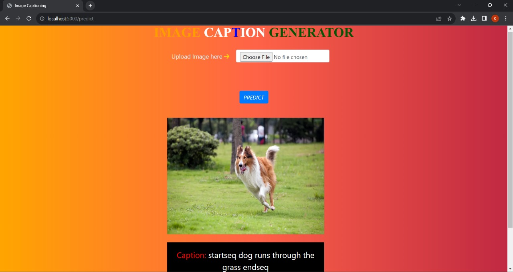

Quick Navigation 
--- 
- [Image captioning model](#image-captioning-model)
  - [Demo](#demo)
  - [Dataset](#dataset)
  - [Model](#model)
    - [DenseNet201](#densenet201)
    - [Data Generation](#data-generation)
    - [LSTM](#lstm)
  - [Running the project](#running-the-project)
  - [Technologies used](#technologies-used)
  - [License](#license)
  - [Authors](#authors)

# Image captioning model 
This project uses `DenseNet201`, `CNN` and `LSTM` to generate captions for images. The model is trained on the [Flickr8k](https://www.kaggle.com/adityajn105/flickr8k) dataset. The model is trained on a GPU for 20 epochs. The model is then tested on a few images from the test dataset. The model is able to generlize well and generate captions for images it has never seen before.

## Demo 


## Dataset
The dataset used for this project is the [Flickr8k](https://www.kaggle.com/adityajn105/flickr8k) dataset. The dataset contains 8000 images. The dataset is split into 6000 images for training, 1000 images for validation and 1000 images for testing. The dataset also contains 5 captions for each image. The dataset is preprocessed and the captions are cleaned before training the model.

## Model
The model is trained on a GPU for 20 epochs. The model is then tested on a few images from the test dataset. The model is able to generlize well and generate captions for images it has never seen before. The model is trained on a GPU for 20 epochs. The model is then tested on a few images from the test dataset. The model is able to generlize well and generate captions for images it has never seen before. The model has mainly 3 parts:
- `DenseNet201` - The `DenseNet201` model is used to extract features from the images. The model is pretrained on the `ImageNet` dataset. The model is used as a feature extractor and the last layer is removed. The model is then used to extract features from the images.
- `Data Generation` - The `Data Generation` part is used to generate data for training the model. The data is generated using the `DenseNet201` model. The model is used to extract features from the images. The features are then used to train the `LSTM` model.
- `LSTM` - The `LSTM` model is used to generate captions for the images. The model is trained on the features extracted from the images.

### DenseNet201
The `DenseNet201` model is used to extract features from the images. The model is pretrained on the `ImageNet` dataset. The model is used as a feature extractor and the last layer is removed. The model is then used to extract features from the images.DenseNet 201 Architecture is used to extract the features from the images. Any other pretrained architecture can also be used for extracting features from these images. Since the Global Average Pooling layer is selected as the final layer of the DenseNet201 model for our feature extraction, our image embeddings will be a vector of size 1920

### Data Generation
Since Image Caption model training like any other neural network training is a highly resource utillizing process we cannot load the data into the main memory all at once, and hence we need to generate the data in the required format batch wise. The inputs will be the image embeddings and their corresonding caption text embeddings for the training process. The text embeddings are passed word by word for the caption generation during inference time

### LSTM
The `LSTM` model is used to generate captions for the images. The model is trained on the features extracted from the images.DenseNet 201 Architecture is used to extract the features from the images. Any other pretrained architecture can also be used for extracting features from these images. Since the Global Average Pooling layer is selected as the final layer of the DenseNet201 model for our feature extraction, our image embeddings will be a vector of size 1920. The image embedding representations are concatenated with the first word of sentence ie. starseq and passed to the LSTM network. The LSTM network starts generating words after each input thus forming a sentence at the end

## Running the project

1. Clone the repository
```bash 
git clone https://github.com/tarunganesh2004/Image-Captioning.git
```

2. Install the requirements
```bash
pip install -r requirements.in
```

3. Run the project
```bash
python flask_wrapper.py
```

## Technologies used
[![Python][python-shield]][python-url]
[](https://flask.palletsprojects.com/)

[![Tensorflow][tensorflow-shield]][tensorflow-url]
[![DenseNet201][densenet201-shield]][densenet201-url]
[![LSTM][lstm-shield]][lstm-url]
[![CNN][cnn-shield]][cnn-url]


## Authors
- [Sri Hari](https://github.com/gtbSrihari)
- [Tarun Ganesh](https://github.com/tarunganesh2004)


<!-- Markdown liks and Tags -->
[python-shield]: https://img.shields.io/badge/Python-3.8.5-blue?style=for-the-badge&logo=python
[python-url]: https://www.python.org/downloads/release/python-385/
[flask-shield]: https://img.shields.io/badge/Flask-Web%20Framework-green?style=flat&logo=flask&logoColor=white
[flask-url]: https://flask.palletsprojects.com/
[tensorflow-shield]: https://img.shields.io/badge/Tensorflow-2.5.0-blue?style=for-the-badge&logo=tensorflow
[tensorflow-url]: https://www.tensorflow.org/
[densenet201-shield]: https://img.shields.io/badge/DenseNet201-blue?style=for-the-badge&logo=tensorflow
[densenet201-url]: https://www.tensorflow.org/api_docs/python/tf/keras/applications/DenseNet201
[lstm-shield]: https://img.shields.io/badge/LSTM-blue?style=for-the-badge&logo=tensorflow
[lstm-url]: https://www.tensorflow.org/api_docs/python/tf/keras/layers/LSTM
[cnn-shield]: https://img.shields.io/badge/CNN-blue?style=for-the-badge&logo=tensorflow
[cnn-url]: https://www.tensorflow.org/api_docs/python/tf/keras/layers/Conv2D

